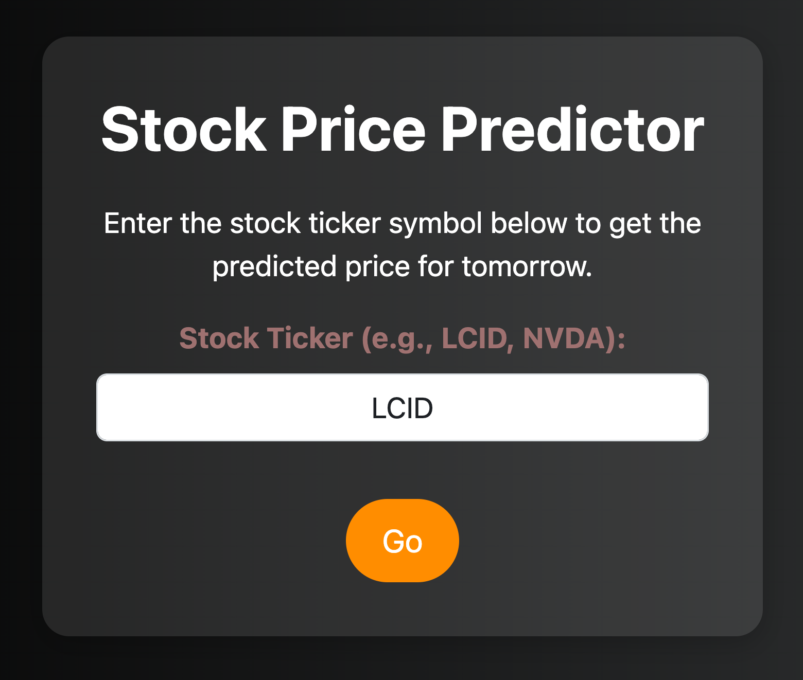
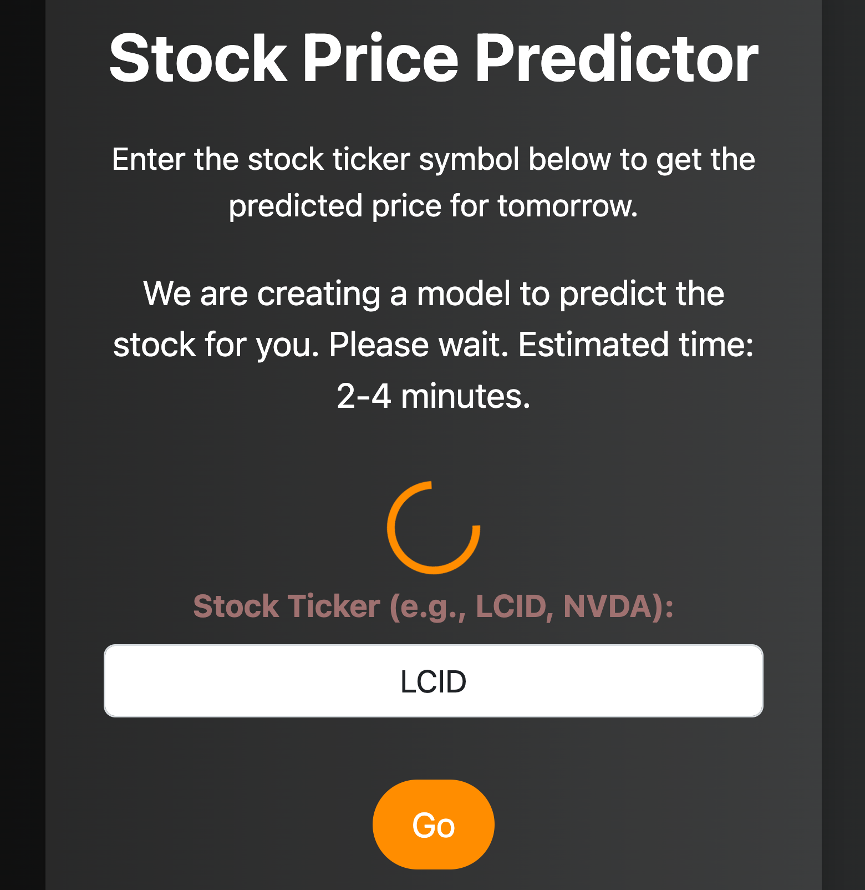
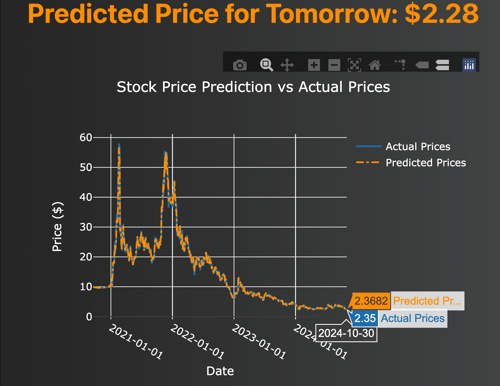

# Stock Price Predictor

A Flask web application that predicts the next day's stock price for a given ticker symbol. This project uses historical stock data, data cleaning, and a deep learning regression model to forecast prices. Users can enter a stock ticker, and the application displays a predicted price along with a graph comparing historical prices and the predicted trend. as well as a live up-to-date portfolio management with a watchlist, notification and compare features.
---

# Table of Contents

- [Features](#Features)
- [Setup Instructions](#Setup-Instructions)
- [Usage](#usage)
- [Technologies Used](#Technologies-Used)
- [File Descriptions](#File-Descriptions)
- [License](#License)

---

# Features
- User-Friendly Interface: Simple and elegant UI built with Bootstrap.
- Real-Time Stock Prediction: Fetches historical data and predicts the stock price for the next day.
- Plotly Visualizations: Displays a line chart of historical prices with a predicted trend overlay.
- Machine Learning Model: Utilizes a Random Forest Regressor model to forecast stock prices.
- Loading Animation: Interactive loading message during data processing and model training.

---

# Setup Instructions
## 1. Installation:
**Clone the Repository:** ` git clone https://github.com/Abdulaziz-Aleissa/stock_predictor_app.git
cd stock_predictor_app ` 
**Install Required Packages:** ` pip install Flask yfinance sqlalchemy pandas scikit-learn plotly ` 
**Run the Application:** ` python app/run.py `

---

# Usage
**1. Enter Stock Ticker:**  On the main page, enter a stock ticker symbol (e.g., AAPL, NVDA) and click "Go".

**2. Wait for Processing:** A loading message will appear, indicating that the model is being created. This may take 2-4 minutes.

**3. View Prediction:** Once complete, you’ll see the predicted price for the next day, along with a Plotly graph comparing historical prices and the predicted trend.

---

# Technologies Used

- Flask: For the web framework.
- yfinance: To fetch historical stock data.
- SQLAlchemy: To handle SQLite database interactions.
- pandas: For data manipulation and cleaning.
- scikit-learn: For machine learning model (Random Forest Regressor).
- Plotly: For interactive visualizations.
- Bootstrap: For responsive, attractive UI.

---

# File Descriptions

**1. run.py:** 
- The main Flask application file.
- Manages routes for the main page (/) and prediction page (/predict).
- Orchestrates data fetching, cleaning, model training, and prediction.
**2. main.html:**
- The homepage where users enter a stock ticker.
- Displays a loading message and animation upon form submission.
**3. go.html:**
- Displays the prediction result and a Plotly chart of historical and predicted prices.
**4. process_data.py:**
- Contains functions to fetch stock data from yfinance, clean it, and save it in an SQLite database.
**5. train_classifier.py:**
- Contains functions to train a Random Forest Regressor on the stock data and save the model as a .pkl file.
- Functions include load_data(), build_model(), evaluate_model(), and save_model().
**6. stock_model.pkl:**
- Example model file, storing the trained Random Forest Regressor.

---

# License

This project is open-source and is a gift of knowledge, created to empower and inspire others. You are free to use, modify, and share this project.
