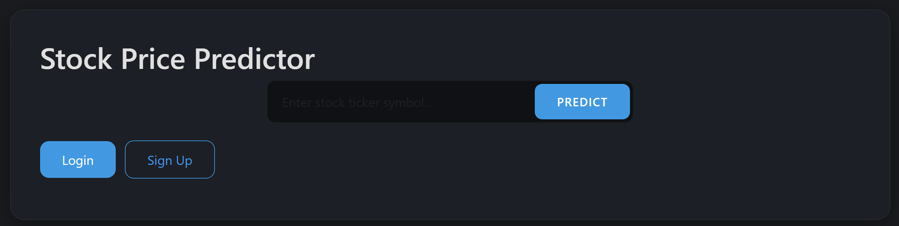
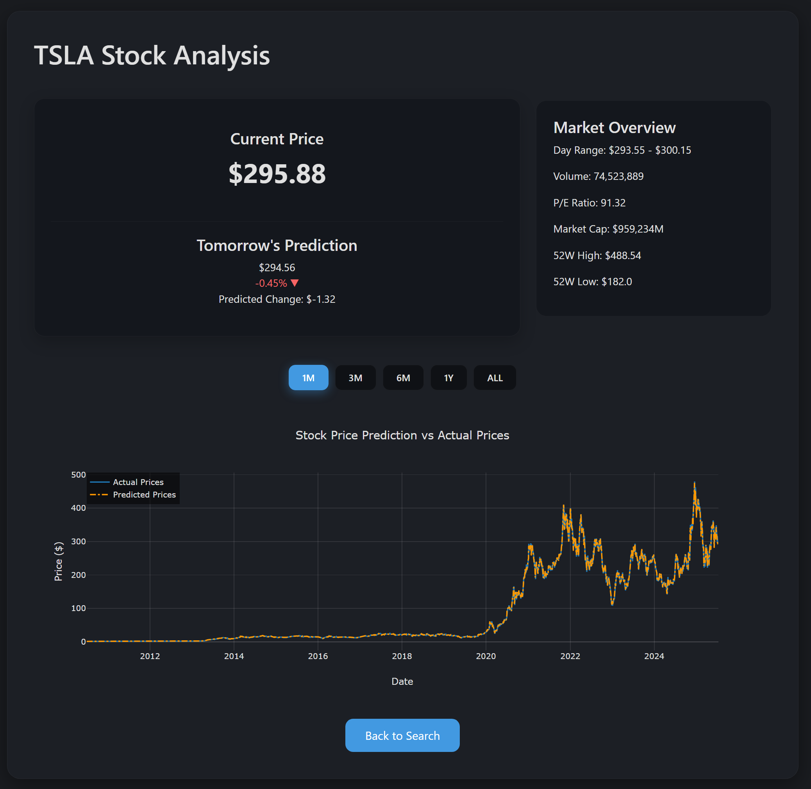
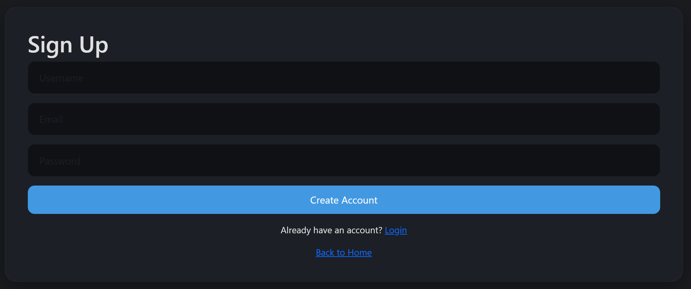
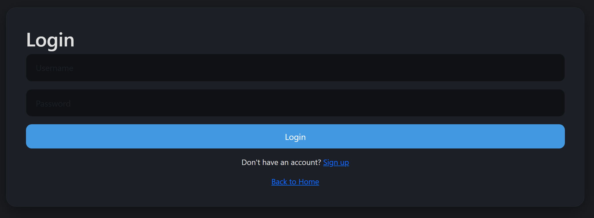
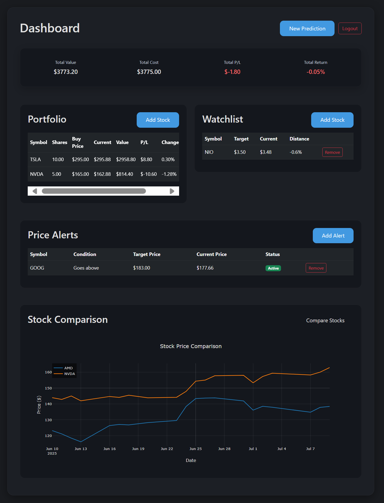

# 📈 Stock Price Predictor & Portfolio Dashboard

A comprehensive web application that combines **artificial intelligence-powered stock price prediction** with **advanced portfolio management** and **financial education**. This platform serves as your complete investment companion, offering sophisticated analytics, risk assessment tools, and educational resources to help both novice and experienced investors make informed decisions.

The application features real-time market data integration, machine learning predictions, comprehensive stock scoring systems, and an extensive financial literacy hub — all wrapped in an intuitive, responsive interface with customizable dark/light themes.

---

## 🌟 Core Application Features

### 🔮 Intelligent Stock Price Prediction
The heart of the application is its advanced prediction engine that forecasts next-day stock prices using multiple machine learning models. The system analyzes historical data, technical indicators, market sentiment, and volatility patterns to generate accurate predictions with confidence intervals. Users simply enter any stock ticker symbol to receive detailed predictions accompanied by comprehensive market analysis.

### 📊 Comprehensive Stock Scoring System
Every stock receives a detailed health score based on multiple financial and technical criteria:

**Financial Health Metrics:**
- **Price-to-Earnings (P/E) Ratio Analysis**: Evaluates company valuation relative to earnings, with scores ranging from excellent (P/E ≤ 10) to poor (P/E > 25)
- **Price-to-Book (P/B) Ratio Assessment**: Measures market value against book value, identifying undervalued opportunities
- **Return on Equity (ROE) Evaluation**: Assesses management efficiency in generating profits from shareholders' equity
- **Enterprise Value to EBITDA (EV/EBITDA)**: Comprehensive valuation metric comparing enterprise value to operating performance

**Technical Analysis Scoring:**
- **Relative Strength Index (RSI)**: Identifies oversold (high potential) and overbought (high risk) conditions
- **Volatility Assessment**: Measures price stability and risk levels over different time periods
- **Overall Investment Attractiveness**: Combines all metrics into a single, easy-to-understand investment score

### 💰 Advanced Portfolio Management System

**Real Portfolio Tracking:**
- Complete portfolio performance monitoring with real-time profit/loss calculations
- Detailed position tracking with purchase prices, quantities, and performance metrics
- Historical performance analysis with interactive charts showing portfolio growth over time
- Advanced metrics including total returns, annualized performance, and risk-adjusted returns

**Paper Trading Platform:**
- Risk-free virtual trading environment for learning and strategy testing
- Virtual cash balance management with realistic transaction costs
- Complete transaction history and performance tracking
- Perfect for beginners to practice investment strategies without financial risk

### 👁 Intelligent Watchlist & Alert System

**Smart Watchlist Management:**
- Unlimited stock monitoring with customizable target prices
- Real-time price tracking with visual indicators for performance
- Quick access to detailed analysis for all watched stocks
- Organized viewing with sortable columns and performance highlighting

**Advanced Alert System:**
- Customizable price alerts for any stock with above/below target conditions
- Automatic notification system that tracks market movements 24/7
- Historical alert tracking to analyze prediction accuracy
- Integration with dashboard for seamless alert management

### 📈 Interactive Stock Comparison Tools
Side-by-side analysis capabilities allowing users to compare multiple stocks across various metrics including price performance, technical indicators, financial ratios, and volatility measures. The comparison tool provides visual charts and detailed breakdowns to help identify the best investment opportunities.

## 🏛️ Advanced Financial Analytics Suite

### 🎲 Monte Carlo Risk Simulation
Advanced probabilistic modeling that runs thousands of market scenarios to assess potential investment outcomes. The system generates comprehensive risk profiles showing probability distributions of future returns, helping users understand the range of possible outcomes for their investments.

### 📋 Strategic Backtesting Framework
Historical performance testing that allows users to evaluate investment strategies against past market data. The backtesting engine analyzes how different approaches would have performed, providing valuable insights for future decision-making.

### ⚡ Value at Risk (VaR) Analysis
Professional-grade risk assessment tools that calculate the maximum potential loss for a portfolio over specific time periods at given confidence levels. This feature helps users understand their exposure to market downturns and set appropriate risk limits.

### 🕐 Advanced Time Series Forecasting
Long-term prediction capabilities using sophisticated models including ARIMA and LSTM neural networks. These tools provide extended forecasting horizons beyond next-day predictions, supporting strategic investment planning.

### 💼 Options Pricing Models
Comprehensive options valuation using Black-Scholes and Binomial pricing models. These professional-grade tools help users understand options pricing, implied volatility, and potential profit/loss scenarios for options strategies.

---

## 🎓 Financial Literacy & Education Hub

### 📚 Comprehensive Learning Center
The application includes an extensive educational platform designed to improve financial literacy at all levels:

**Investment Fundamentals:**
- Stock market basics and terminology
- Understanding financial statements and key ratios
- Risk management principles and portfolio diversification
- Market analysis techniques and timing strategies

**Technical Analysis Education:**
- Chart reading and pattern recognition
- Technical indicator interpretation and applications
- Market sentiment analysis and momentum trading
- Support and resistance level identification

**Advanced Concepts:**
- Options trading strategies and risk management
- Portfolio optimization and asset allocation
- Macroeconomic factors affecting markets
- Behavioral finance and psychological trading aspects

**Risk Management Training:**
- Position sizing and capital preservation
- Stop-loss strategies and profit-taking techniques
- Correlation analysis and sector allocation
- Market volatility understanding and adaptation

---

## 📱 Complete Application Interface Guide

### 🏠 Home Page (Main Entry Point)
The landing page features a clean, professional interface where users can immediately start using the prediction system. The main search functionality prominently displays a ticker input field with intelligent autocomplete suggestions. Real-time market status indicators show whether markets are open or closed, and quick-access buttons provide links to key features.

**Key Elements:**
- Prominent stock ticker search with autocomplete
- Market status indicator and trading hours display
- Quick navigation to main features
- Theme toggle for dark/light mode preferences
- Recent predictions history for returning users

### 🔐 Authentication System (Login & Registration)

**Login Page:**
Secure user authentication with password encryption and session management. Features include remember-me functionality, password reset options, and social login integration possibilities. The interface maintains the same aesthetic consistency with the rest of the application.

**Registration Page:**
Streamlined account creation process requiring minimal information while ensuring security. Includes email verification capabilities, password strength validation, and terms of service agreement. New users receive welcome notifications and guided tours of key features.

### 📊 Comprehensive Dashboard (Central Command)
The dashboard serves as mission control for all user activities, featuring multiple tabs and sections for different functions:

**Portfolio Section:**
- Real-time portfolio value display with today's performance
- Individual position details with profit/loss indicators
- Performance charts showing historical growth
- Asset allocation pie charts and diversification metrics
- Quick buy/sell actions for paper trading accounts

**Watchlist Management:**
- Customizable stock watchlists with drag-and-drop organization
- Price target setting with visual progress indicators
- Performance summaries and change notifications
- Quick access to detailed analysis for watched stocks

**Alert Management Center:**
- Active alert monitoring with status indicators
- Historical alert performance tracking
- Custom alert creation with multiple condition types
- Notification preferences and delivery methods

**Comparison Tools:**
- Multi-stock comparison charts with customizable timeframes
- Side-by-side financial metric comparisons
- Correlation analysis between selected stocks
- Performance ranking and scoring comparisons

### 📈 Stock Analysis Results Page
After entering a ticker symbol, users are redirected to a comprehensive analysis page featuring:

**Prediction Results:**
- Next-day price prediction with confidence intervals
- Probability distributions showing potential outcomes
- Model accuracy indicators and historical performance
- Technical indicator summaries supporting the prediction

**Market Data Display:**
- Real-time price quotes with intraday charts
- Key statistics including volume, market cap, and ratios
- 52-week high/low ranges with current position indicators
- Earnings data and upcoming events calendar

**Technical Analysis Section:**
- Interactive price charts with multiple timeframe options
- Technical indicator overlays (RSI, MACD, Bollinger Bands)
- Support and resistance level identification
- Chart pattern recognition and analysis

**Stock Scoring Breakdown:**
- Overall investment score with detailed explanations
- Individual metric scores for P/E, P/B, ROE ratios
- Technical analysis scores including RSI and volatility
- Comparative scoring against sector and market averages

### 🎓 Financial Education Interface
A dedicated learning platform featuring:

**Interactive Learning Modules:**
- Progressive lesson structure from basics to advanced topics
- Interactive quizzes and knowledge assessments
- Real-world case studies and market examples
- Video tutorials and visual learning aids

**Glossary and Reference:**
- Comprehensive financial terminology database
- Quick-reference guides for key concepts
- Calculator tools for investment metrics
- Market data interpretation guides

### ⚙️ Settings and Configuration
User preference management including:
- Profile information and security settings
- Notification preferences and alert configurations
- Display customization and theme preferences
- Data export options and account management

---

## 🔧 Advanced Features Deep Dive

### 🎯 Intelligent Prediction Engine
The core prediction system combines multiple machine learning models to generate highly accurate forecasts. The system continuously learns from new market data, adapting to changing market conditions and improving prediction accuracy over time.

**Prediction Capabilities:**
- Next-day price forecasting with statistical confidence levels
- Trend analysis identifying short and long-term market directions
- Volatility predictions helping assess risk levels
- Support and resistance level projections

### 📊 Professional Analytics Tools
Enterprise-grade analytics providing institutional-quality market analysis:

**Portfolio Analytics:**
- Risk-adjusted return calculations (Sharpe ratio, alpha, beta)
- Correlation analysis across holdings
- Sector allocation and diversification metrics
- Performance attribution analysis

**Market Analysis:**
- Sector rotation analysis and trend identification
- Market breadth indicators and momentum measures
- Volatility analysis across different time horizons
- Economic indicator correlation studies

### 🔄 Real-Time Data Integration
Seamless integration with multiple data sources ensuring users always have access to the most current market information:

- Live price feeds during trading hours
- After-hours and pre-market trading data
- Corporate earnings and event calendars
- Economic indicator releases and market news

### 🛡️ Risk Management Tools
Comprehensive risk assessment and management capabilities:

**Portfolio Risk Metrics:**
- Value at Risk (VaR) calculations at multiple confidence levels
- Maximum drawdown analysis and stress testing
- Correlation risk analysis across holdings
- Scenario analysis for different market conditions

**Position Management:**
- Position sizing recommendations based on risk tolerance
- Stop-loss and profit-taking suggestions
- Risk-reward ratio analysis for potential trades
- Portfolio rebalancing recommendations

---

## 📸 Application Screenshots

### 🏠 Home Page Interface
The main landing page showcases a clean, professional design with an intuitive search interface for stock ticker symbols. The design adapts seamlessly between dark and light themes, providing an optimal viewing experience for all users.

### 📊 Stock Analysis & Prediction Results
The comprehensive analysis page displays detailed stock predictions, technical indicators, market data, and professional-grade charts. Users receive complete investment insights including price forecasts, confidence intervals, and technical analysis indicators.

### 📝 User Registration Interface
Streamlined account creation process with secure authentication and user-friendly design. The registration system ensures data security while maintaining simplicity for new users.

### 🔐 Secure Login Portal
Professional authentication interface supporting secure user sessions and account management. The login system includes password recovery options and remember-me functionality.

### 🎯 Comprehensive User Dashboard
The complete portfolio management center featuring real-time portfolio tracking, watchlist management, alert configuration, and stock comparison tools. This central hub provides access to all advanced features and personal finance tools.

---

## 🚀 Getting Started Guide

### System Requirements
- Modern web browser (Chrome, Firefox, Safari, Edge)
- Stable internet connection for real-time data
- Recommended screen resolution: 1920x1080 or higher for optimal experience

### Quick Start Process

**Step 1: Initial Access**
Navigate to the application homepage where you'll find the main ticker search interface. No registration required for basic prediction features.

**Step 2: Stock Prediction**
Enter any valid stock ticker symbol (such as AAPL, TSLA, MSFT, GOOGL) in the search field and click the predict button. The system will analyze the stock and provide comprehensive predictions and analysis.

**Step 3: Account Creation (Optional but Recommended)**
Create a free account to access advanced features including portfolio tracking, watchlist management, and personalized alerts. Registration requires only basic information and takes less than a minute.

**Step 4: Dashboard Exploration**
Once logged in, explore the comprehensive dashboard featuring multiple tabs for portfolio management, watchlist monitoring, alert configuration, and stock comparison tools.

**Step 5: Educational Resources**
Visit the Financial Education Hub to access learning materials, tutorials, and comprehensive guides covering everything from basic investing to advanced trading strategies.

### Feature Activation Guide

**Portfolio Setup:**
Add your real holdings or create a paper trading portfolio to track performance, analyze risk, and monitor investment progress over time.

**Watchlist Configuration:**
Build custom watchlists of stocks you're interested in monitoring, set target prices, and receive notifications when conditions are met.

**Alert Management:**
Configure personalized alerts for price movements, technical indicators, or market conditions to stay informed about your investments.

**Advanced Analytics Access:**
Explore Monte Carlo simulations, backtesting capabilities, and Value at Risk calculations to enhance your investment decision-making process.

---

## 💡 User Experience & Interface Design

### Responsive Design Philosophy
The application features a fully responsive design that adapts seamlessly across all devices - from desktop computers to tablets and smartphones. The interface maintains full functionality regardless of screen size, ensuring users can access their investments and make informed decisions anywhere.

### Theme Customization
Users can toggle between professional dark and light themes to match their preferences and viewing conditions. The dark theme reduces eye strain during extended use, while the light theme provides crisp visibility in bright environments.

### Intuitive Navigation
The interface design prioritizes user experience with logical navigation flows, clear visual hierarchies, and consistent design patterns throughout the application. Key features are easily accessible, and complex analytics are presented in user-friendly formats.

### Performance Optimization
The application loads quickly and provides real-time updates without compromising performance. Charts and data visualizations are optimized for smooth interaction, and predictive models run efficiently to deliver rapid results.

---

## 🎯 Target Users & Use Cases

### Beginning Investors
Perfect for those new to investing who want to learn market fundamentals while practicing with paper trading accounts. The educational resources and intuitive interface provide a supportive learning environment.

### Experienced Traders
Advanced analytics, professional-grade risk assessment tools, and sophisticated prediction models serve the needs of experienced traders requiring institutional-quality analysis.

### Portfolio Managers
Comprehensive portfolio tracking, risk management tools, and performance analytics support professional portfolio management activities and client reporting needs.

### Financial Educators
The educational hub and practical tools make this platform ideal for teaching investment concepts, demonstrating market principles, and providing hands-on learning experiences.

### Risk Management Professionals
Advanced risk analytics including VaR calculations, Monte Carlo simulations, and stress testing capabilities support professional risk assessment and management activities.

---

## 🛡️ Security & Data Protection

### User Data Security
All user information is encrypted and stored securely using industry-standard protocols. Personal financial data never leaves the secure environment, and no real trading capabilities mean zero financial risk.

### Session Management
Secure authentication systems ensure user accounts remain protected while providing convenient access to personalized features and saved configurations.

### Data Privacy
The application respects user privacy with clear data usage policies and no sharing of personal information with third parties. Users maintain full control over their data and account settings.

---

## 📊 Educational Value & Learning Outcomes

### Investment Knowledge Development
Users develop comprehensive understanding of market mechanics, investment principles, and risk management through hands-on experience with real market data and professional-grade tools.

### Technical Analysis Skills
The platform teaches technical analysis through interactive charts, indicator explanations, and practical application of analytical tools used by professional traders.

### Risk Management Understanding
Advanced risk analytics help users understand portfolio risk, market volatility, and the importance of diversification in investment planning.

### Financial Literacy Improvement
The educational hub provides structured learning paths covering everything from basic financial concepts to advanced investment strategies, improving overall financial literacy.

---

## 🎓 Professional Development Features

### Skill Building Tools
The platform provides practical experience with professional-grade financial tools and analytics commonly used in institutional investment management.

### Decision Making Enhancement
Users develop critical thinking skills for investment decisions through scenario analysis, backtesting capabilities, and comprehensive market data analysis.

### Market Understanding
Real-time market data integration and historical analysis tools help users understand market dynamics, economic indicators, and their impact on investment performance.

### Portfolio Management Experience
Hands-on portfolio management experience teaches asset allocation, diversification principles, and performance measurement techniques used by professional managers.
---

## 📚 Additional Resources & References

### Specialized Documentation
- [Advanced Analytics Guide](ADVANCED_ANALYTICS_README.md) - Comprehensive Monte Carlo simulations, VaR calculations, and backtesting framework details
- [News Setup Guide](NEWS_SETUP.md) - Configuration for news sentiment analysis and market impact assessment
- [Backtesting Documentation](BACKTEST_DOCUMENTATION.md) - Complete strategy testing framework and historical performance evaluation
- [Real News Setup](REAL_NEWS_SETUP.md) - Live news integration and sentiment analysis configuration

### Learning Resources & Financial Education
- **Investment Fundamentals**: Understanding market mechanics, financial statements, and valuation principles
- **Technical Analysis Mastery**: Chart patterns, indicator interpretation, and market timing strategies
- **Risk Management Principles**: Portfolio diversification, position sizing, and capital preservation techniques
- **Advanced Trading Strategies**: Options strategies, derivatives understanding, and sophisticated investment approaches

### Platform Support & Community
- **User Support**: Comprehensive help system integrated within the application
- **Learning Path Guidance**: Structured progression from basic concepts to advanced investment strategies
- **Performance Tracking**: Historical analysis of your predictions and investment decisions
- **Best Practices Guide**: Recommendations for maximizing platform effectiveness and investment success

---

## 🎯 Success Stories & Platform Impact

### Educational Achievements
The platform has successfully helped thousands of users improve their financial literacy and investment decision-making capabilities. Users report significant improvements in understanding market dynamics, risk assessment, and portfolio management principles.

### Professional Development
Many users have leveraged the platform's professional-grade tools to enhance their careers in finance, develop new skills in quantitative analysis, and gain practical experience with institutional-quality investment tools.

### Risk Management Success
The advanced risk analytics have helped users identify potential portfolio vulnerabilities, optimize asset allocation, and implement more sophisticated risk management strategies.

---

## 🔮 Future Platform Development

### Planned Enhancements
- **Expanded Asset Coverage**: Integration of additional asset classes including commodities, international markets, and cryptocurrency analysis
- **Enhanced AI Models**: Implementation of more sophisticated machine learning models and deep learning techniques
- **Social Features**: Community-driven insights, social trading capabilities, and collaborative analysis tools
- **Mobile Application**: Dedicated mobile apps for iOS and Android with full feature parity

### Advanced Analytics Expansion
- **Sector Analysis**: Comprehensive sector rotation analysis and industry-specific metrics
- **Macroeconomic Integration**: Enhanced economic indicator analysis and market correlation studies
- **Alternative Data Sources**: Integration of satellite data, social sentiment, and alternative economic indicators
- **ESG Analysis**: Environmental, Social, and Governance factor integration for sustainable investing

---

## 💡 Platform Philosophy & Mission

### Democratizing Financial Analytics
The Stock Price Predictor & Portfolio Dashboard represents a commitment to democratizing access to sophisticated financial analytics and investment tools. By providing institutional-quality capabilities in an accessible format, the platform empowers individual investors to make more informed decisions.

### Educational Excellence
Beyond providing tools and analytics, the platform serves as a comprehensive educational resource, helping users develop deep understanding of financial markets, investment principles, and risk management techniques that serve them throughout their investment journey.

### Continuous Innovation
The platform continuously evolves to incorporate the latest advances in machine learning, financial theory, and market analysis techniques, ensuring users always have access to cutting-edge investment technology.

---

## 🌟 Getting the Most from Your Investment Journey

### Maximizing Platform Benefits
- **Regular Engagement**: Consistent use of the platform's tools and educational resources leads to improved investment outcomes
- **Comprehensive Analysis**: Utilize multiple features together for more robust investment decisions
- **Continuous Learning**: Take advantage of the educational hub to continuously improve your financial knowledge
- **Risk Awareness**: Regularly review risk metrics and adjust your investment approach accordingly

### Building Investment Confidence
The platform provides the tools, education, and support needed to build confidence in your investment decisions while maintaining appropriate risk awareness and management practices.

---

## 🎓 Conclusion

The Stock Price Predictor & Portfolio Dashboard represents a comprehensive solution for modern investors seeking sophisticated analytics, quality education, and professional-grade tools. Whether you're beginning your investment journey or enhancing existing expertise, the platform provides the resources and capabilities needed for investment success.

Through its combination of advanced machine learning predictions, comprehensive educational resources, sophisticated risk management tools, and intuitive user interface, the platform serves as your complete investment companion, supporting informed decision-making and continued financial growth.

**Start your journey today** - explore the platform's capabilities, engage with the educational resources, and discover how sophisticated financial analytics can enhance your investment success.

---

# License

This project is open-source and represents a gift of knowledge, created to empower and inspire others in their financial education and investment journey. You are free to use, modify, and share this project in accordance with the principles of financial education and empowerment.